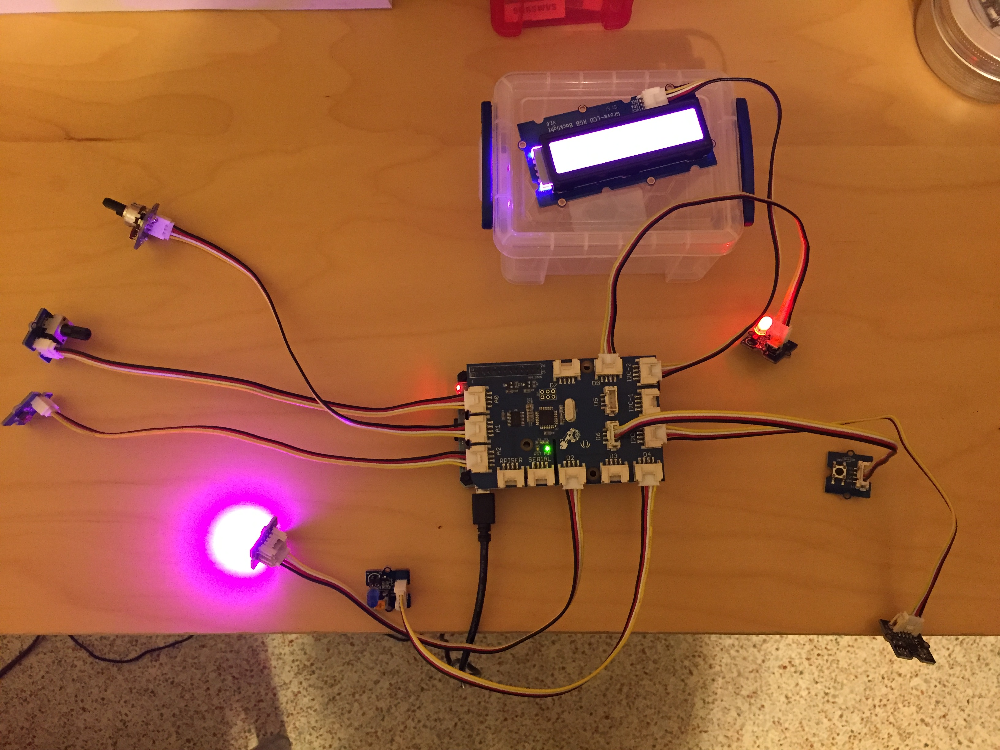

GrovePi / Blynk Sample applications
===================================

The purpose of this sample application was to test the integration of grovepi, blynk and the PyBlynkRestApi module.

GrovePI was setup on a Raspberry PI with the following Sensors:

Button: GrovePI D6 - Blynk V20

LED: GrovePI D3 - Blynk V21

LED: GrovePI D5 - Blynk V22

RGB LED: GrovePI D2 - Blynk (r)V30,(g)V31,(b)V32

3 Axis Accelerometer: GrovePI I2C - Blynk (x)V27, (y)V28, (z)V29

Rotary: GrovePI A0 = Blynk V23

Rotary: GrovePI A1 - Blynk V24

Light Sensor: GrovePI A2 - Blynk V25

RGB LCD: GrovePI I2C - Blynk V26

Blynk Application 
-----------------

PyBlynkRestApi Project
----------------------

https://github.com/youngsoul/PyBlynkRestApi

A picture of the Raspberry PI with the GrovePI sensors is below:

